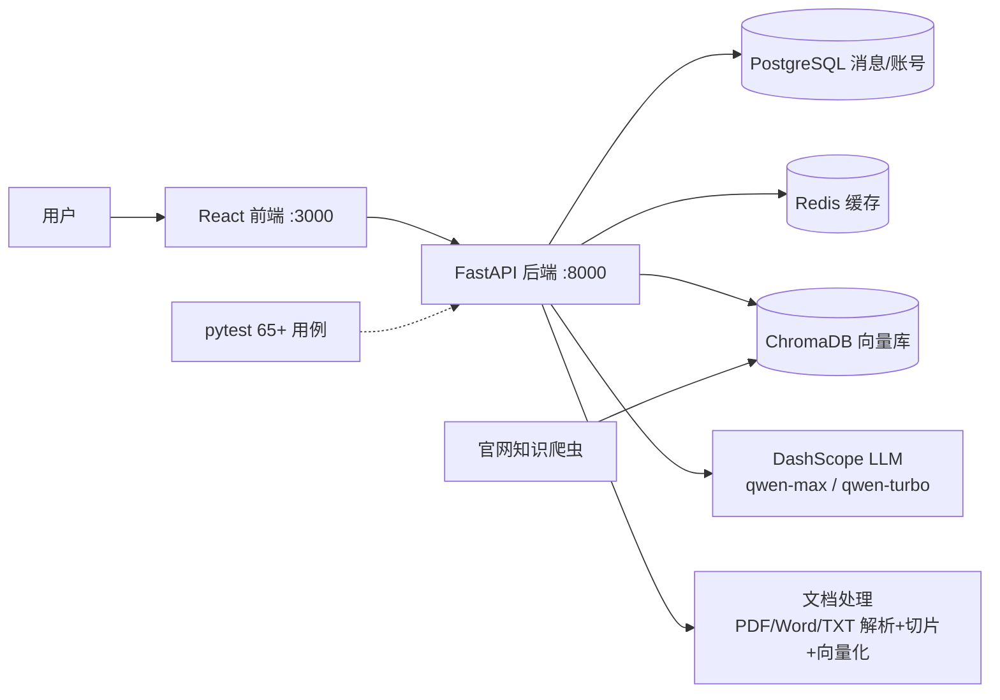

# RAG 智能客服系统（rag-support-agent）

企业知识库问答客服系统：基于 **RAG（检索增强生成）** 的智能客服后端与前端，内置「规则前置拦截 → 检索 → 拒答阈值短路 → LLM 分诊 → 分支生成」五段式问答链路，配合 24 道自动化评测，重点解决客服场景的**防幻觉、分诊、强制转人工**三个核心问题。

[](https://github.com/lauraleeyeah-collab/rag-support-agent/actions)


> 说明：本项目为本地开发环境可运行的个人作品，用于演示 RAG 客服系统的工程落地能力。

## 目录

- [核心特性](#核心特性)
- [系统架构](#系统架构)
- [技术栈](#技术栈)
- [快速开始](#快速开始)
- [一键评测](#一键评测)
- [官网知识爬虫](#官网知识爬虫)
- [目录结构](#目录结构)
- [安全说明](#安全说明)
- [Roadmap](#roadmap)
- [许可证](#许可证)

## 核心特性

| 机制 | 说明 | 设计目的 |
|---|---|---|
| 规则前置拦截 | 命中退款/投诉/订单/安全/情绪等关键词分组 → 直接转人工，**不进检索、不依赖模型** | 高风险问题 0 延迟转人工，防止模型误答 |
| 拒答阈值短路 | 检索 Top-1 相似度低于阈值 → 固定话术拒答，**不调用 LLM** | 机制层面 100% 拒答，杜绝编造 |
| LLM 分诊 | 轻量模型 + JSON Mode 输出 `{question_type, kb_coverage, action}`，解析失败兜底谨慎 | 区分直接回答/谨慎回答/转人工三种策略 |
| 谨慎回答尾缀 | `action=cautious` 时程序性追加固定提示 | 政策边界问题 100% 附带风险提示 |
| 引用溯源 | 回答附带检索片段引用（citations），前端可查看来源 | 回答可追溯，便于质检 |
| 一键评测 | 24 道题（覆盖/未覆盖/应转人工三类）自动判定，输出 Markdown 报告 | 阈值校准可量化，可接入 CI 拦截 |

一次问答链路：

```text
用户提问
   │
   ▼
① 规则前置拦截 ──命中退款/投诉/安全等──▶ 🔴 直接转人工（不调用模型）
   │ 未命中
   ▼
② 向量检索（ChromaDB Top-K）
   │
   ▼
③ 拒答阈值短路 ──Top-1 分数 < 阈值──▶ ⚪ 拒答（不调用模型）
   │ 达标
   ▼
④ LLM 分诊（qwen-turbo + JSON Mode）
   │
   ├─ direct   ──▶ 🟢 直接回答（qwen-max 生成）
   ├─ cautious ──▶ 🟡 谨慎回答（生成 + 程序性尾缀）
   └─ human    ──▶ 🔴 转人工话术
```

前端按分诊结果渲染标签：🟢 直接回答 / 🟡 谨慎回答 / 🔴 已转人工 / ⚪ 暂时无法确认。

## 系统架构



所有服务由 `docker-compose.yml` 编排，一键启动。

## 技术栈

- **后端**：Python 3.12 · FastAPI · SQLAlchemy (async) · Redis · ChromaDB · LangChain · DashScope (通义千问)
- **前端**：React 18 · TypeScript · Vite
- **工程化**：Docker Compose · pytest（依赖 stub 单测，无需外部服务） · Ruff · GitHub Actions CI · MIT License

## 快速开始

前置要求：安装 Docker（含 Docker Compose）。

```bash
# 1. 配置 API Key
cd backend
cp .env.example .env
# 编辑 .env，填入 DASHSCOPE_API_KEY（阿里云 DashScope）

# 2. 启动全部服务（Postgres / Redis / ChromaDB / 后端 / 前端）
cd ..
docker-compose up --build
```

启动成功的标志：

- `rag_postgres` 显示 healthy
- `rag_chromadb` 显示 healthy
- `rag_backend` 显示 `Application startup complete`
- `rag_frontend` 显示 `ready in xxx ms`

打开浏览器：

- 前端：http://localhost:3000
- 后端接口文档：http://localhost:8000/docs

使用流程：

1. 用管理员账号登录（默认 `admin / 123456`，**仅限本地演示**，见[安全说明](#安全说明)）
2. 左下角「知识库管理」上传商品/产品文档（PDF/Word/TXT）
3. 等待文档状态变为「已就绪」
4. 切换到对话页面提问

停止：`Ctrl+C`，数据保留在 Docker 卷中；下次启动 `docker-compose up`（无需 `--build`）。

## 一键评测

24 道评测题覆盖三类场景（题库在 `eval/test_questions.xlsx`）：

| 类别 | 题数 | 期望行为 | 判定方式 |
|---|---|---|---|
| 第一类·知识库覆盖到 | 8 | 直接回答 / 谨慎回答 | 机器初判 + 人工核对清单 |
| 第二类·知识库覆盖不到 | 8 | 明确拒答，不编造 | 全自动判定，**要求 100%** |
| 第三类·应转人工 | 8 | 转人工 / 谨慎回答 | 全自动判定 |

```bash
# 后端启动后执行
python eval/run_eval.py                  # 跑 24 题，输出 eval/eval_report.md
python eval/run_eval.py --calibrate      # 校准模式：打印分诊分布，辅助调阈值
```

- 拒答准确率（第二类）未达 100% 时报告显著告警并以退出码 1 结束，可接入 CI 拦截
- 第一类导出 `eval/eval_review_checklist.md` 供人工核对准确率
- 阈值在 `backend/.env` 中通过 `RETRIEVAL_MIN_SCORE` / `TRIAGE_COVERED_SCORE` 调整

## 官网知识爬虫

把官网文档/帮助中心抓取入库，作为知识库来源之一（产品页、FAQ、售后政策等）。

```bash
pip install -r scripts/requirements-crawler.txt
python scripts/crawler_official_site.py              # 抓取并入库
python scripts/crawler_official_site.py --dry-run    # 只抓取与分块，不入库（调试）
```

- 抓取目标在 `scripts/crawl_targets.json` 中配置，按目标官网替换 URL
- **合规保障**：robots.txt 预检（禁抓路径自动跳过）、UA 标识、同域名请求间隔 ≥1 秒
- **语义分块**：按 h2/h3 标题切「主题单元」，表格/列表整块保留，不机械按字数切
- **去重**：`doc_id = md5(url)`，同 URL 重抓先删后插（重抓 = 更新）
- 爬虫不足的模块可走「知识库管理」页手动上传文档补充

## 目录结构

```text
rag-support-agent/
├── backend/                  # FastAPI 后端
│   ├── app/
│   │   ├── api/              # 接口路由（认证/知识库/对话）
│   │   ├── core/             # 配置、安全、全局常量（文案/规则/枚举唯一来源）
│   │   ├── db/               # 数据库模型、迁移
│   │   ├── schemas/          # 请求/响应数据结构
│   │   └── services/         # RAG 主链路、分诊、文档处理、缓存
│   ├── main.py               # 应用入口（建表/迁移/自动创建管理员）
│   ├── Dockerfile
│   └── requirements.txt
├── frontend/                 # React + TS 前端
│   ├── src/
│   │   ├── pages/            # 登录 / 知识库管理 / 对话
│   │   ├── components/       # 组件（含分诊标签渲染）
│   │   ├── store/            # 状态管理
│   │   └── services/         # API 调用
│   └── Dockerfile
├── eval/                     # 24 题评测（run_eval.py + 题库 xlsx）
├── scripts/                  # 官网知识爬虫 + 抓取目标配置
├── tests/                    # 65+ 单元测试（依赖 stub，无需外部服务）
├── docker-compose.yml        # 一键编排 Postgres/Redis/ChromaDB/前后端
└── pyproject.toml            # pytest / ruff 配置
```

## 安全说明

- 默认管理员账号 `admin / 123456` 与 JWT 密钥 `change-this-in-production` **仅用于本地演示**
- 生产部署必须通过 `backend/.env` 覆盖：`ADMIN_PASSWORD`、`SECRET_KEY`、`DASHSCOPE_API_KEY`
- 当 `ENVIRONMENT=production` 且密钥/密码仍为默认值时，后端启动会直接报错拒绝运行
- `.env` 已在 `.gitignore` 中排除，不会进入版本库
- 上传文件白名单：`.pdf / .docx / .txt / .md`，单文件上限 50MB

## Roadmap

- [x] 规则前置拦截 + 拒答阈值短路（不依赖模型的确定性兜底）
- [x] LLM 分诊（JSON Mode）+ 谨慎回答尾缀
- [x] 24 道自动化评测 + 阈值校准模式
- [x] 官网知识爬虫（robots 合规 + 语义分块 + 去重）
- [x] Docker Compose 一键编排 + CI（pytest + ruff + 密钥扫描）
- [ ] 会话级敏感信息脱敏（手机号/地址识别）
- [ ] 多知识库隔离（按产品线分库）
- [ ] 评测报告历史趋势可视化
- [ ] 在线体验 Demo 环境

## 许可证

[MIT](LICENSE)
